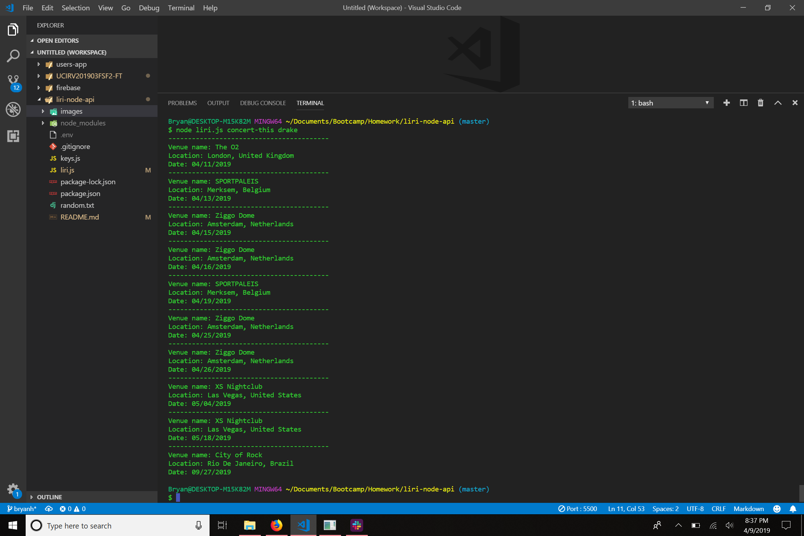

# liri-node-api

Here's a language interpretation and recognition interface written in node.js. It's able to display upcoming concerts of an artist/band, info of a song, and info of a movie.

To use, just run liri.js with two arguments:
```javascript 
    node liri.js [command] [query]
```

There are four commands:
```
    concert-this [name of artist/band]
    spotify-this-song [name of song]
    movie-this [name of movie]
    do-what-it-says (no second argument)
```

**Notice**: If "do-what-it-says" command is used, no second argument is needed. This command gets the command and query contained in the text file.





